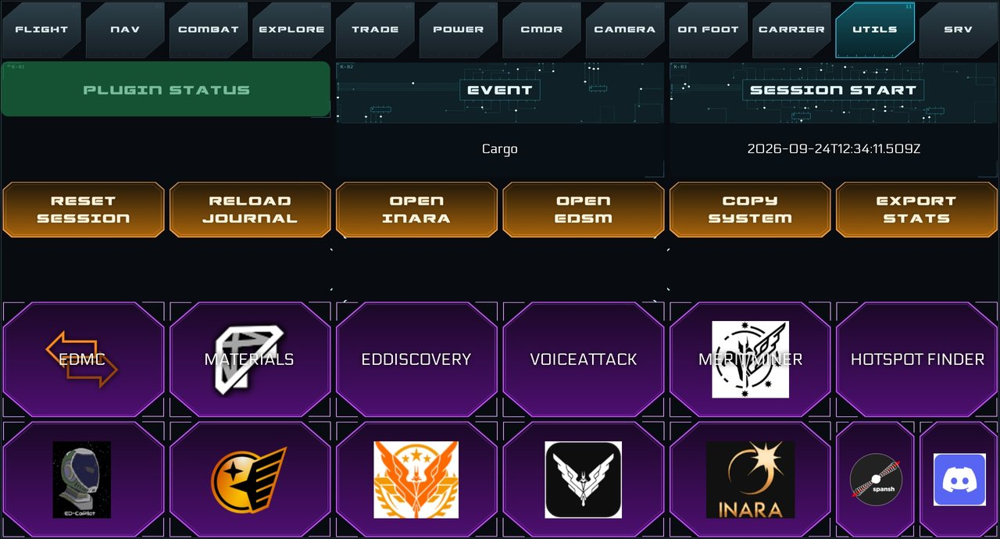
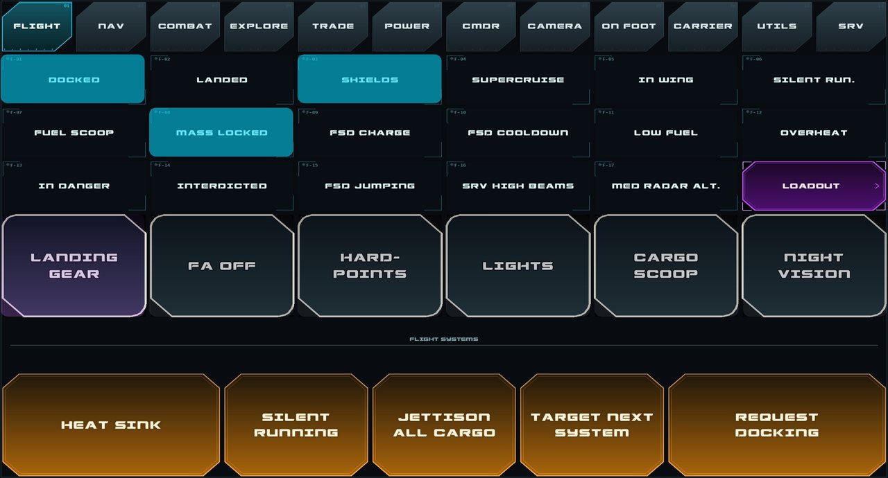

# Guía de instalación

*[English version](../INSTALL.md)*

Esta guía te lleva paso a paso desde cero hasta tener la tablet funcionando. Calcula unos **20–30 minutos**, la mayor parte para las teclas del final.

**Índice**

1. [Qué necesitas](#1-qué-necesitas)
2. [Instalar Node.js](#2-instalar-nodejs)
3. [Preparar Touch Portal y la tablet](#3-preparar-touch-portal-y-la-tablet)
4. [Instalar el plugin](#4-instalar-el-plugin-tpp)
5. [Instalar las páginas](#5-instalar-las-páginas)
6. [Ver las páginas en la tablet](#6-ver-las-páginas-en-la-tablet)
7. [Primera prueba con el juego](#7-primera-prueba-con-el-juego)
8. [Configurar las teclas (obligatorio)](#8-configurar-las-teclas-obligatorio)
9. [Opcional: lanzadores de aplicaciones](#9-opcional-lanzadores-de-aplicaciones)
10. [Actualizar y desinstalar](#10-actualizar-y-desinstalar)
11. [Solución de problemas](#11-solución-de-problemas)

---

## 1. Qué necesitas

| | |
|---|---|
| ☐ **PC con Windows 10 u 11** | el mismo en el que juegas a Elite Dangerous |
| ☐ **Elite Dangerous** | Horizons u Odyssey, arrancado al menos una vez |
| ☐ **Una tablet** (Android o iPad) | en horizontal, idealmente 16:10 (por ejemplo, de 10–11"). En un móvil funciona, pero todo queda diminuto. |
| ☐ **Touch Portal** | la aplicación de escritorio en el PC y la app de Touch Portal en la tablet, los dos en la misma red wifi. Casi seguro necesitarás **Touch Portal Pro** para la rejilla grande de botones y las varias páginas. |
| ☐ **Node.js 18 o posterior** | gratis. Es lo que hace funcionar el plugin (sección 2). |
| ☐ Los dos ficheros de la versión | `ED-TouchPortal-Plugin-v0.1.0-beta.tpp` y `ED-TouchPortal-Pages-v0.1.0-beta.zip` |

---

## 2. Instalar Node.js

El plugin es un pequeño programa que lee los ficheros de registro del juego. Funciona con **Node.js**, que solo hay que instalar una vez.

1. **Comprueba si ya lo tienes.** Pulsa `Win + R`, escribe `cmd` y pulsa Intro. En la ventana negra, escribe:
   ```
   node -v
   ```
   - Si ves una versión como `v20.11.0` (18 o superior), pasa a la sección 3.
   - Si dice *"'node' no se reconoce…"*, sigue.
2. Entra en <https://nodejs.org> y descarga la versión **LTS** para Windows.
3. Ejecuta el instalador y **deja todas las opciones por defecto**. Añade Node al PATH, que es lo que necesita el plugin.
4. **Reinicia el PC.** Touch Portal no ve Node hasta después de reiniciar.
5. Vuelve a ejecutar `node -v` para confirmar que está instalado.

---

## 3. Preparar Touch Portal y la tablet

Si Touch Portal ya te funciona en la tablet, sáltate esta sección.

1. Instala la aplicación de **escritorio** de Touch Portal desde <https://www.touch-portal.com>.
2. Instala la app **Touch Portal** en la tablet desde Play Store o App Store.
3. Abre las dos y conecta la tablet al PC. Si lo necesitas, la web de Touch Portal tiene una guía de conexión.
4. **Cierra Touch Portal del todo** antes del siguiente paso: clic derecho en su icono de la bandeja de Windows (junto al reloj) → **Exit**. Cerrar la ventana no basta, porque sigue ejecutándose en segundo plano.

---

## 4. Instalar el plugin (`.tpp`)

1. Abre la aplicación de escritorio de Touch Portal.
2. Abre el **menú de ajustes** (icono ⚙) y elige **Import plug-in…**.
3. Selecciona `ED-TouchPortal-Plugin-v0.1.0-beta.tpp`.
4. Touch Portal te pregunta si confías en el plugin. Elige **Trust** para que pueda arrancar solo.
5. **Cierra Touch Portal del todo** (icono de la bandeja → Exit) y vuelve a abrirlo.

✅ **Comprobación:** en los ajustes de plugins de Touch Portal aparece **ED Touch Portal Plugin**. Al editar un botón, la lista de acciones incluye ahora categorías como *Ship Status*, *Navigation* y *Plugin Utilities*.

---

## 5. Instalar las páginas

Las páginas traen un script de instalación que deja cada fichero en su sitio.

1. **Cierra Touch Portal del todo** (icono de la bandeja → Exit).
2. **Descomprime** `ED-TouchPortal-Pages-v0.1.0-beta.zip` en una carpeta normal: clic derecho → *Extraer todo…*. No ejecutes nada desde dentro del zip.
3. En la carpeta descomprimida, **clic derecho en `install.ps1` → Ejecutar con PowerShell**.
   - Si Windows dice que el script está bloqueado, o la ventana se cierra enseguida:
     1. Clic derecho en `install.ps1` → **Propiedades**, marca **Desbloquear** abajo y Aceptar. Vuelve a probar.
     2. Si aun así no arranca, haz clic en la barra de direcciones de la carpeta, escribe `powershell` y pulsa Intro. En la ventana que se abre, ejecuta:
        ```powershell
        powershell -ExecutionPolicy Bypass -File .\install.ps1
        ```
4. El script muestra cada página a medida que la copia y termina con **"Done: 14 pages installed"**.

Qué hace el script, para que no haya sorpresas:
- Copia las 14 páginas en `%APPDATA%\TouchPortal\pages\New Plug In\`.
- Copia los fondos e iconos en `%APPDATA%\TouchPortal\icons\`.
- Si ya tenías páginas con los mismos nombres, primero hace una copia de seguridad en `%APPDATA%\TouchPortal\ed-touchportal-backup-<fecha>\`.
- Pone tu carpeta de usuario de Windows en los botones lanzadores de aplicaciones.
- No cambia nada más.

<details>
<summary><b>¿Prefieres copiar los ficheros a mano?</b></summary>

1. Pulsa `Win + R`, escribe `%APPDATA%\TouchPortal` y pulsa Intro.
2. Copia todos los `.tml` de la carpeta `pages` del zip en `pages\New Plug In\`. Crea la carpeta si no existe y llámala **exactamente** `New Plug In`, porque los botones de navegación dependen de ese nombre.
3. Copia todo lo de la carpeta `icons` del zip en `icons\`.
4. Los lanzadores de UTILS seguirán apuntando a rutas `%LOCALAPPDATA%\…`. Corrígelas en Touch Portal si los usas (sección 9).
</details>

---

## 6. Ver las páginas en la tablet

1. Abre Touch Portal. La lista de páginas (arriba en la aplicación de escritorio) incluye ahora páginas que empiezan por **ED -**.
2. La página de inicio es **ED - Vuelo** (la pestaña FLIGHT). Desde ahí, la barra de pestañas de arriba lleva a todas las demás.
3. Para llegar a ella desde la página principal de la tablet, abre tu página **(main)** en la aplicación de escritorio, añade un botón y ponle la acción **Go to page → ED - Vuelo**.
4. **En la tablet, desconecta y vuelve a conectar del todo**, o cierra y abre la app. Touch Portal guarda las imágenes antiguas y, después de instalar páginas, un simple refresco muchas veces no basta.

> Por ahora los ficheros de página tienen el nombre en español, aunque todo lo que se ve en pantalla está en inglés:
> **Vuelo** = Flight · **Navegación** = Nav · **Combate** = Combat · **Exploración** = Explore · **Comercio** = Trade · **Cámara** = Camera · **A Pie** = On Foot · **Utilidades** = Utils · **Estación** = Station

---

## 7. Primera prueba con el juego

1. Arranca Elite Dangerous y entra en la partida (en tu nave).
2. En la tablet, abre **UTILS**. La casilla **PLUGIN STATUS** debe mostrar **CONNECTED**.
   - `NO_JOURNAL` significa que el plugin no encuentra la carpeta de registros del juego. Mira la [solución de problemas](#11-solución-de-problemas).
   - Si no cambia nada, el plugin no se está ejecutando. Revisa Node.js (sección 2) y la importación del plugin (sección 4).
3. Abre **FLIGHT**. Las casillas de estado (DOCKED, SHIELDS, SUPERCRUISE…) se iluminan según el estado de tu nave.
4. Abre **CMDR**. Aparecen tu nombre de comandante, tus rangos y tu nave.

Así se ven UTILS y FLIGHT cuando todo funciona (las casillas iluminadas dependen de lo que esté haciendo tu nave):




Si todo eso funciona, la parte de datos en vivo está lista. 🎉

---

## 8. Configurar las teclas (obligatorio)

Las casillas de estado funcionan solas. **Los botones que hacen algo en el juego, como el tren de aterrizaje, las luces, las órdenes al caza, la cámara o el SRV, pulsan teclas del teclado.** Solo funcionan si esas teclas están asignadas en *tu* juego.

👉 **Sigue la [guía de asignación de teclas](KEYBINDS.md).** Explica las dos formas de arreglarlo (cambiar el juego o cambiar el botón) e incluye una lista de comprobación con todas las asignaciones que necesitas.

---

## 9. Opcional: lanzadores de aplicaciones

La mitad de abajo de **UTILS** tiene botones que abren aplicaciones y webs: EDMC, EDDiscovery, VoiceAttack, ED Odyssey Materials Helper, EDHM-UI, ED CoPilot, ICARUS Terminal, Discord, Inara, Spansh, Merit Miner y el buscador de hotspots de EDTools. Dan por hecho que cada aplicación está en su carpeta de instalación por defecto.

Si un lanzador no hace nada, o no usas esa aplicación:
1. En la aplicación de escritorio de Touch Portal, abre **ED - Utilidades** y haz clic en el lanzador.
2. En **On Pressed**, cambia la ruta de la acción *Run application* por la del `.exe` de la aplicación en tu PC, o sustituye la acción por otra.
3. Guarda.

---

## 10. Actualizar y desinstalar

**Actualizar a una versión nueva**
1. Cierra Touch Portal.
2. Importa el `.tpp` nuevo (sección 4). Sustituye al plugin anterior.
3. Ejecuta el `install.ps1` nuevo (sección 5). **Se sobrescribirán los cambios que hayas hecho en las páginas**, incluidas las teclas cambiadas con la opción B de la guía de teclas. El script guarda antes una copia de las páginas antiguas, así que puedes recuperar de ahí los botones que modificaste.
4. Reconecta la tablet.

**Desinstalar**
1. En los ajustes de plugins de Touch Portal, elimina **ED Touch Portal Plugin**.
2. Borra las páginas `ED - *.tml` de `%APPDATA%\TouchPortal\pages\New Plug In\` y los ficheros `BG_ED_*.jpg` de `%APPDATA%\TouchPortal\icons\`.
3. Si añadiste teclas en el juego, puedes dejarlas o quitarlas. No afectan a nada más.

---

## 11. Solución de problemas

| Problema | Solución |
|---|---|
| **PLUGIN STATUS no cambia / el plugin no aparece** | ¿Está instalado Node.js (`node -v`)? ¿Reiniciaste el PC después de instalarlo? Vuelve a importar el `.tpp` y elige *Trust*. |
| **PLUGIN STATUS muestra `NO_JOURNAL`** | No se encuentra la carpeta de registros del juego. Suele ser `%USERPROFILE%\Saved Games\Frontier Developments\Elite Dangerous`. Si la tuya está en otro sitio (por ejemplo, porque OneDrive movió *Partidas guardadas*), crea una variable de entorno de Windows llamada `ED_JOURNAL_FOLDER` con la carpeta correcta (Inicio → *"Editar las variables de entorno del sistema"* → Variables de entorno → Nueva). Después cierra y vuelve a abrir Touch Portal. |
| **Páginas en negro / sin fondos** | Los ficheros `BG_ED_*.jpg` tienen que estar en `%APPDATA%\TouchPortal\icons\`, no en la carpeta de páginas. Vuelve a ejecutar `install.ps1`. |
| **La tablet sigue mostrando páginas antiguas o mezcladas** | Cierra Touch Portal del todo (bandeja → Exit), vuelve a abrirlo y desconecta y reconecta la tablet por completo. |
| **Las pestañas de arriba no cambian de página** | Las páginas tienen que estar en una carpeta llamada exactamente `New Plug In`. Vuelve a ejecutar `install.ps1`. |
| **Las casillas de estado funcionan, pero los botones no hacen nada en el juego** | Son las teclas: mira la [guía de asignación de teclas](KEYBINDS.md). |
| **Valores que parecen atascados o incorrectos tras una sesión larga** | En **UTILS**, pulsa **RELOAD JOURNAL**. **RESET SESSION** pone a cero los contadores de la sesión. |
| **Los créditos no cuadran del todo** | Es una limitación conocida: el juego no informa del saldo después de cada operación. Se corrige sola la próxima vez que se carga la partida. |

¿Sigues atascado? Abre una [incidencia en GitHub](../../../../issues) e incluye el estado que muestra PLUGIN STATUS en UTILS, lo que has probado y una foto de la tablet si algo se ve mal.
